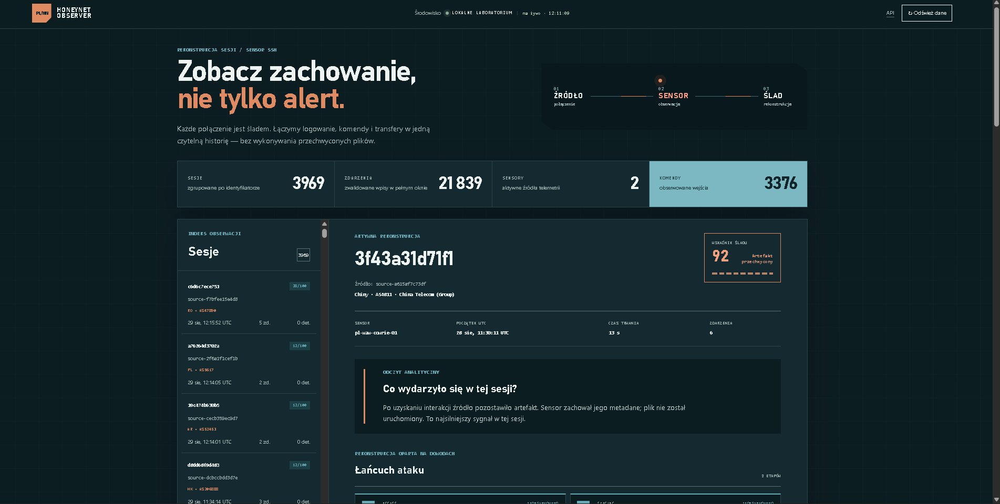
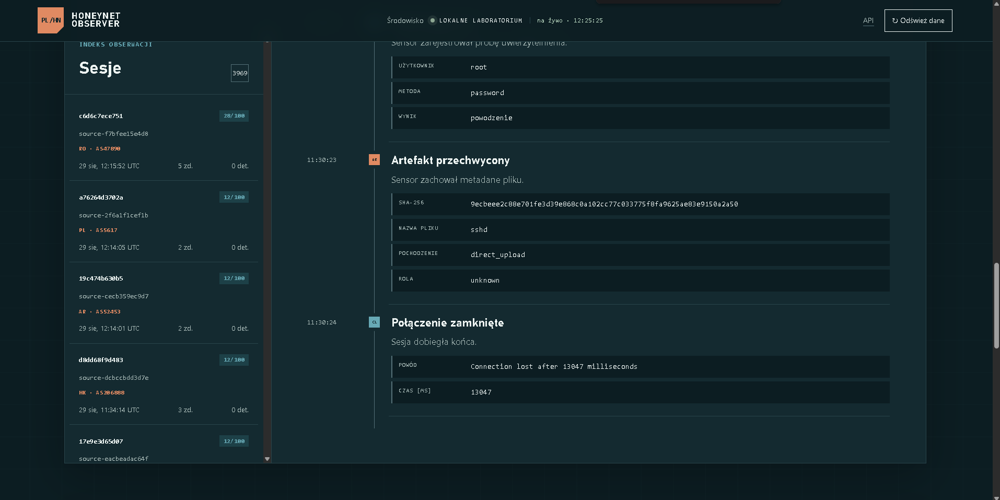
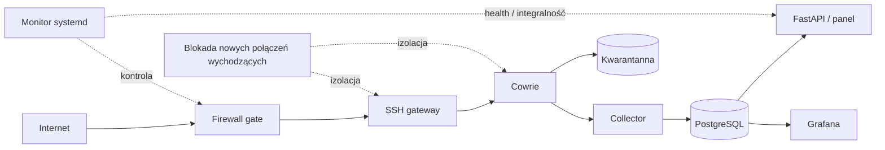
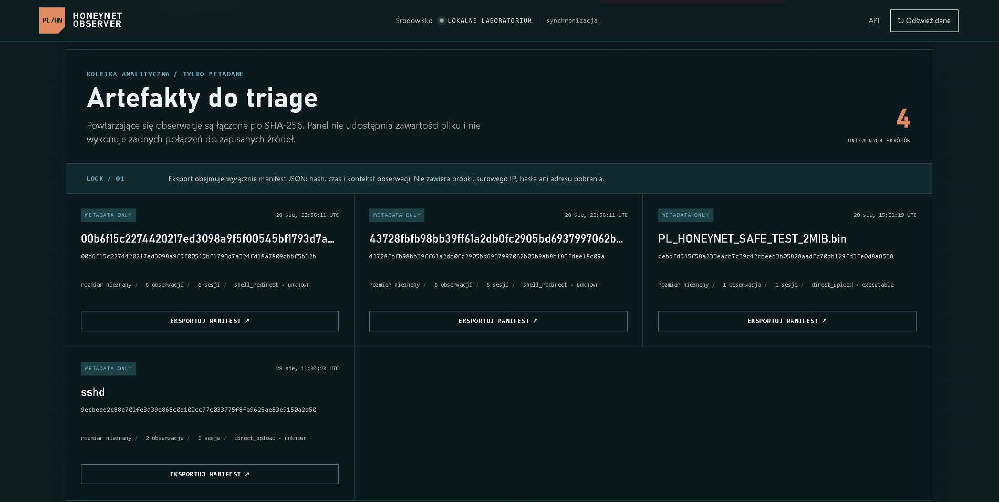
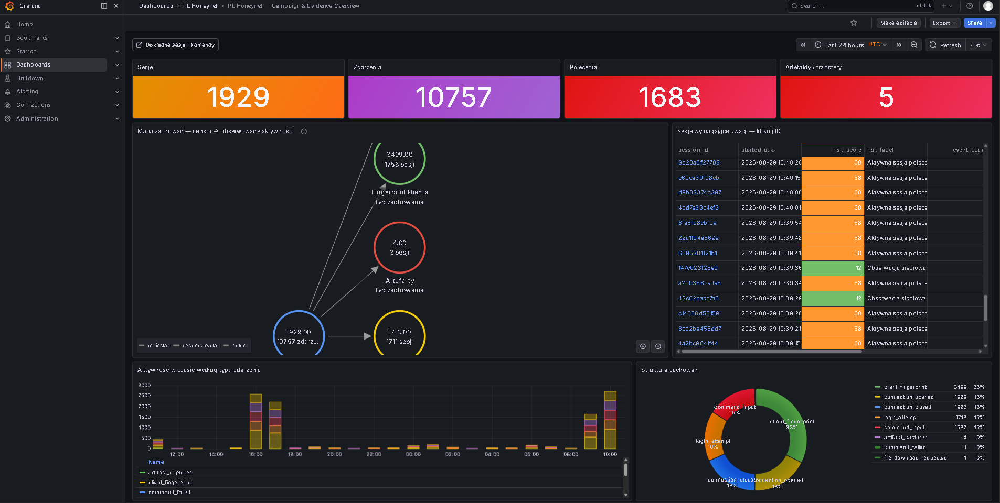

# PL Honeynet Observer

Projekt studencki do bezpiecznego zbierania i analizowania telemetrii z własnego
sensora SSH honeypot. System łączy pojedyncze zdarzenia Cowrie w sesje, wykrywa
obserwowane zachowania, pseudonimizuje źródła i pokazuje wyniki w autorskim panelu
oraz Grafanie.

Najważniejszym założeniem projektu jest izolacja. Sensor nie może służyć jako punkt
wyjścia do innych systemów, a przechwycone pliki są zapisywane w kwarantannie i
nigdy nie są wykonywane przez pipeline analityczny.



## Co udało się zbudować

- adapter i przyrostowy collector dla `cowrie.json`,
- walidację oraz idempotentny import JSONL,
- korelację zdarzeń po `session_id`,
- ocenę ryzyka i wyjaśnialne detekcje zachowań,
- rekonstrukcję osi czasu sesji,
- profile klientów SSH, HASSH oraz lokalny kontekst GeoIP/ASN,
- deduplikowaną kolejkę metadanych artefaktów po SHA-256,
- panel FastAPI i osobny dashboard Grafana,
- retencję danych, monitoring, kontrolę integralności i awaryjny kill switch,
- filtrowanie ruchu wychodzącego z izolowanej części sensora.

W pilotażowym uruchomieniu system zebrał kilka tysięcy sesji i zarejestrował między
innymi bezpośrednie transfery plików. Poniższy przykład pokazuje metadane pliku
`sshd` przesłanego w dwóch sesjach. Plik został zachowany, ale nie uruchomiony.



## Architektura



Panel aplikacji i Grafana są związane wyłącznie z `localhost` i na VPS są dostępne
przez tunel SSH. Publicznie wystawiany jest tylko emulowany sensor. PostgreSQL
pozostaje w wewnętrznej sieci Dockera.

## Widoki analityczne

Autorski panel służy do czytania pojedynczych sesji: pokazuje logowanie, polecenia,
transfery, detekcje i chronologiczną rekonstrukcję. Widoki nie ujawniają surowych
adresów IP ani przechwyconych haseł.



Grafana daje widok zagregowany: liczbę sesji i zdarzeń, aktywność w czasie,
strukturę zachowań i listę sesji wymagających uwagi.



## Bezpieczeństwo

Projekt jest defensywny i działa wyłącznie na infrastrukturze należącej do
operatora projektu. Nie zawiera aktywnego skanowania, odwetu ani eksploatacji
systemów zewnętrznych.

Najważniejsze zabezpieczenia:

- administracja SSH wyłącznie kluczem, bez logowania roota i bez haseł,
- osobna bramka sensora, domyślnie zamknięta,
- `DOCKER-USER` blokujący nowe połączenia wychodzące z sieci sensora,
- automatyczny kill switch uruchamiany po błędzie monitoringu,
- baseline integralności kodu, konfiguracji i obrazów,
- limity CPU, RAM, procesów, rozmiaru pojedynczego pliku i całej kwarantanny,
- panel, Grafana oraz baza niewystawione bezpośrednio do Internetu,
- eksporty publiczne oparte na allowliście i pseudonimizacji.

Pełna checklista znajduje się w [`docs/safety.md`](docs/safety.md), a model
obsługi próbek w [`docs/sample-handling.md`](docs/sample-handling.md).

## Uruchomienie lokalne

Wymagane są Python 3.12 oraz Docker z Compose.

```powershell
Copy-Item .env.example .env
# Ustaw własne, losowe sekrety w prywatnym pliku .env.
docker compose up -d --build
Invoke-RestMethod http://127.0.0.1:8000/health
```

Dashboard jest dostępny pod `http://127.0.0.1:8000`. Profil z Cowrie uruchamia
się osobno i domyślnie publikuje sensor tylko na loopback:

```powershell
docker compose --profile lab up -d --build
ssh -p 2222 demo@127.0.0.1
```

Zatrzymanie środowiska bez usuwania wolumenów:

```powershell
docker compose --profile lab down
```

## Testy

```powershell
.\.venv\Scripts\ruff.exe check src tests
.\.venv\Scripts\python.exe -m pytest
docker compose config --quiet
```

Fixture'y używają wyłącznie adresów dokumentacyjnych RFC 5737 i domen `.invalid`.
Repozytorium nie zawiera danych z produkcyjnego sensora ani przechwyconych plików.

## Struktura projektu

```text
src/honeynet/          logika aplikacji, API, modele i detekcje
tests/                 testy jednostkowe i integracyjne
fixtures/              wyłącznie syntetyczne zdarzenia JSONL
deploy/pilot/          firewall gate, monitor, baseline i usługi systemd
deploy/grafana/        provisioning i dashboard Grafana
deploy/cowrie-persona/ bezpieczna persona emulowanego hosta
docs/                  metodologia, prywatność i instrukcje bezpieczeństwa
```

## Ograniczenia i dalszy rozwój

- Wynik ryzyka jest heurystyką, a nie dowodem przypisania konkretnej kampanii.
- Lokalizacja IP opisuje infrastrukturę źródłową, nie rzeczywistą lokalizację osoby.
- Projekt nie uruchamia przechwyconych plików; ewentualna analiza statyczna wymaga
  osobnego, odizolowanego laboratorium.
- Do badania ataków ukierunkowanych potrzebne byłyby dodatkowe sensory kontrolne i
  dłuższy okres obserwacji.

Kolejne planowane kroki to bezpieczny eksport próbek do jednorazowego laboratorium
analizy statycznej, lepsze grupowanie kampanii oraz porównanie kilku sensorów.

## Sposób pracy

Projekt powstał z wykorzystaniem narzędzi AI jako wsparcia podczas implementacji i
przeglądu. Decyzje dotyczące architektury, wdrożenia, zabezpieczeń, testów oraz
walidacji działania były podejmowane i sprawdzane przez autora projektu.

## Licencja

Kod jest udostępniany na licencji MIT. Zobacz [`LICENSE`](LICENSE).
