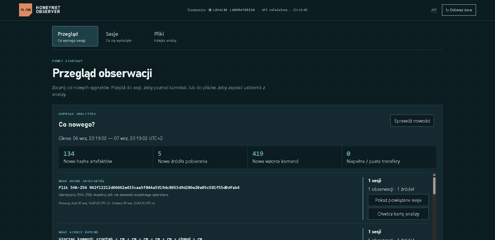
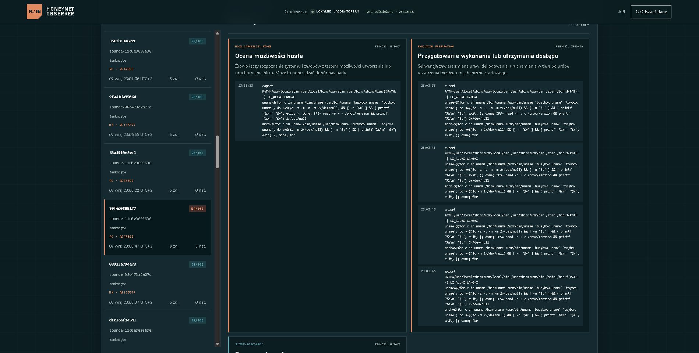
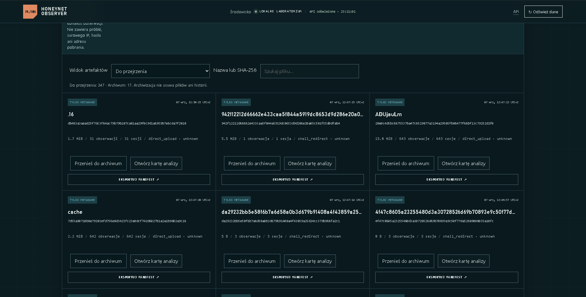

# PL Honeynet Observer

Projekt studencki wspierający analizę aktywności w honeypocie SSH.
Zbiera logi Cowrie, łączy zdarzenia w sesje i pomaga prześledzić polecenia,
próby pobierania oraz metadane pozostawionych plików.

**Technologie:** Python, FastAPI, SQLAlchemy, PostgreSQL / SQLite, Cowrie,
Docker, Linux, Grafana, JavaScript.



*Panel operatora, 7 września 2026. Nowy hash oznacza nowość w zachowanej
historii, nie potwierdzenie nowego malware. Screeny przedstawiają wersję rozwojową.*

## Najważniejsze funkcje

- Rekonstrukcja sesji: logowanie, komendy, transfery i chronologiczna oś zdarzeń.
- Wyjaśnialne detekcje zachowań z dowodami z logów.
- Kolejka metadanych plików deduplikowana po SHA-256.
- Kontekst klientów SSH, HASSH i GeoIP/ASN.
- Izolacja sensora, monitoring, retencja i awaryjny kill switch.

Lokalna wersja rozwojowa dodaje przegląd nowych sygnałów, grupowanie powiązanych
sesji i karty analizy. Pełna aktualizacja jej kodu na GitHub jest w przygotowaniu.

## Przepływ analizy

Logi Cowrie → normalizacja → baza danych → sesja i detekcje → triage pliku.

Projekt służy do ćwiczenia analizy logów, oceny podejrzanej aktywności
i dokumentowania ustaleń. Reguły wskazują zachowania; nie potwierdzają
automatycznie rodziny malware, wspólnego sprawcy ani skuteczności exploita.

<details>
<summary>Sesja: detekcje i dowody z poleceń</summary>

Reguły wskazują rozpoznanie hosta i przygotowanie wykonania; obok widać
polecenia stanowiące podstawę oceny. Źródła są pseudonimizowane.



</details>

<details>
<summary>Pliki: triage i powtarzające się obserwacje</summary>

Kolejka łączy identyczne SHA-256 i pokazuje rozmiary oraz liczbę powiązanych
sesji. Metadane transferu nie zastępują analizy zawartości pliku.



</details>

## Bezpieczeństwo

Sensor działa na infrastrukturze operatora, z ograniczeniami ruchu wychodzącego.
Panel jest dostępny lokalnie lub przez tunel SSH. Pipeline nie wykonuje
przechwyconych plików; raporty publiczne stosują pseudonimizację.

Szczegóły: [bezpieczeństwo](docs/safety.md) ·
[obsługa próbek](docs/sample-handling.md).

<details>
<summary>Uruchomienie i testy</summary>

Wymagane: Python 3.12 oraz Docker Compose.

```powershell
Copy-Item .env.example .env
# Ustaw własne, losowe sekrety w .env.
docker compose up -d --build
Invoke-RestMethod http://127.0.0.1:8000/health
```

Panel: `http://127.0.0.1:8000`. Opcjonalny profil sensora lokalnego:

```powershell
docker compose --profile lab up -d --build
ssh -p 2222 demo@127.0.0.1
```

Testy:

```powershell
.\.venv\Scripts\ruff.exe check src tests
.\.venv\Scripts\python.exe -m pytest
docker compose config --quiet
```

Fixture'y używają adresów dokumentacyjnych i domen `.invalid`.

</details>

Projekt rozwijany z pomocą narzędzi AI podczas implementacji i przeglądu.
Licencja [MIT](LICENSE).
